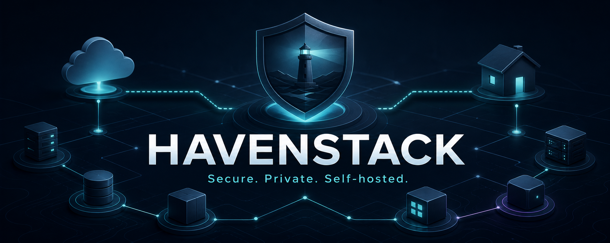

# HavenStack

<p align="center">
  
</p>

<p align="center">
  A modular, security-focused homelab built with Docker Compose across Unraid and NAS infrastructure.
</p>

## Overview

- Cloudflare Tunnel ingress through Traefik
- Central authentication and access policies with Authelia
- Private applications including Nextcloud and Vaultwarden
- Media automation with the Servarr ecosystem and VPN-protected qBittorrent
- Monitoring with Prometheus, Grafana, and Blackbox Exporter
- Segmented Docker networks, health checks, resource limits, and hardened containers

## Stacks

| Location | Stack | Services |
| --- | --- | --- |
| Unraid | Edge | Traefik, Authelia, Cloudflare Tunnel, Cloudflare DDNS |
| Unraid | Apps | Homepage, Vaultwarden |
| Unraid | Nextcloud | Apache, Nextcloud, PostgreSQL, Redis, Notify Push |
| Unraid | Servarr | qBittorrent VPN, Prowlarr, Radarr, Sonarr, Seerr, Profilarr |
| Unraid | Monitoring | Prometheus, Grafana, Blackbox Exporter |
| NAS | Media | Plex |
| NAS | Management | Arcane |

## Repository layout

```text
HavenStack/
├── unraid/
│   ├── edge/
│   ├── apps/
│   ├── nextcloud/
│   ├── servarr/
│   └── monitoring/
└── nas/
    ├── plex/
    └── arcane/
```

## Deployment

Create and configure the environment files before starting any stack:

```bash
cp unraid/.env.example unraid/.env
cp nas/.env.example nas/.env
```

Deploy the Unraid stacks in order:

```bash
docker compose --env-file unraid/.env -f unraid/edge/compose.yml up -d
docker compose --env-file unraid/.env -f unraid/apps/compose.yml up -d
docker compose --env-file unraid/.env -f unraid/nextcloud/compose.yml up -d
docker compose --env-file unraid/.env -f unraid/servarr/compose.yml up -d
docker compose --env-file unraid/.env -f unraid/monitoring/compose.yml up -d
```

Deploy the required NAS stacks separately:

```bash
docker compose --env-file nas/.env -f nas/plex/compose.yml up -d
docker compose --env-file nas/.env -f nas/arcane/docker-compose.yml up -d
```

Review all paths, user IDs, network ranges, domains, and secrets before deployment. Never commit populated environment files.

### Required local configuration

- Copy `unraid/edge/config/authelia/users.yml.example` to `users.yml` and replace the example password with an Argon2id hash.
- Place one provider-supplied OpenVPN profile and its certificates in the qBittorrent `/config/openvpn` directory.
- Ensure the configured Nextcloud data path exists and is writable before starting the stack.

These files and runtime data are intentionally excluded from Git.

## License

Licensed under the terms of the [LICENSE](LICENSE) file.
