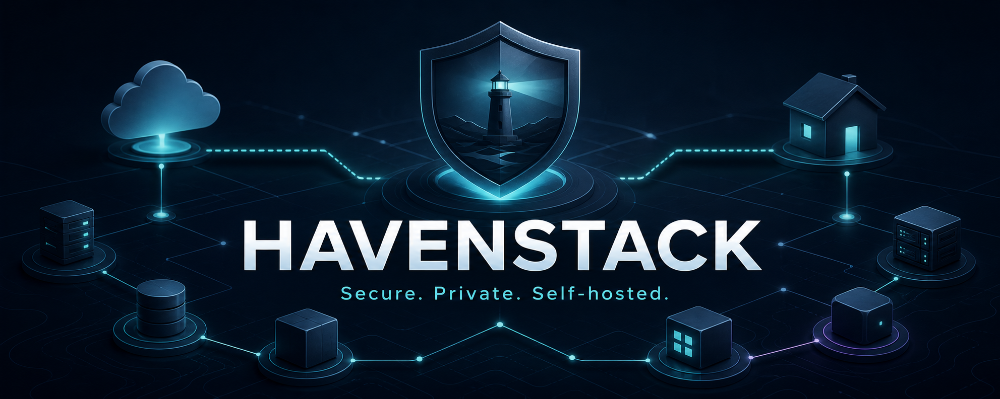

# HavenStack

<p align="center">
  
</p>

<p align="center">
  A modular, security-focused homelab built with Docker Compose across an Unraid server and a Synology NAS.
</p>

<p align="center">
  <a href="https://github.com/shuntps/HavenStack/actions/workflows/validate-compose.yml"></a>
  <a href="LICENSE"></a>
</p>

## Overview

- Cloudflare Tunnel ingress through Traefik, with no host ports published on Unraid
- Central authentication and access policies with Authelia (forward auth + `access_control`)
- Private applications behind Authelia, including Vaultwarden
- Media automation with the Servarr ecosystem and a VPN-protected qBittorrent
- Segmented Docker networks with pinned subnets, health checks, resource limits, and hardened containers

This repository contains only declarative configuration: compose files and the service configs they mount. There is no application code and no build step — `docker compose config` is the test suite.

## Stacks

| Host | Stack | Services |
| --- | --- | --- |
| Unraid | `edge` | Cloudflare Tunnel, Cloudflare DDNS, Traefik, Authelia |
| Unraid | `apps` | Homepage, Vaultwarden |
| Unraid | `servarr` | qBittorrent (VPN), Prowlarr, Radarr, Sonarr, Seerr, Profilarr |
| NAS | `plex` | Plex Media Server (host network) |
| NAS | `arcane` | Arcane container manager (LAN only, `${NAS_IP}:3552`) |

## Repository layout

```text
HavenStack/
├── .github/
│   ├── assets/          # README images
│   ├── ci/              # invariant checks + invariant-exceptions.yml
│   ├── workflows/       # validate-compose, validate-config, check-invariants, lint
│   └── dependabot.yml
├── unraid/
│   ├── .env.example
│   ├── edge/            # compose.yml + config/{traefik,authelia}
│   ├── apps/
│   └── servarr/
└── nas/
    ├── .env.example
    ├── plex/
    └── arcane/
```

Each host has **one** environment file at its root, shared by every stack under it. Because the env file does not sit next to the compose files, every compose command must pass `--env-file`.

## Configuration

Create the environment files and replace every `replace-with-*` placeholder before starting any stack:

```bash
cp unraid/.env.example unraid/.env
cp nas/.env.example nas/.env
```

Review all paths, user IDs, network ranges, domains, and secrets. `UID`/`GID` are used by services that own their own appdata; `NAS_UID`/`NAS_GID` are used by services writing to NAS-mounted media (`radarr`, `sonarr`, `qbittorrent`) so hardlinks and permissions line up across the mount.

### Required local files

These are intentionally excluded from Git and must be provided on the target host:

- Copy `unraid/edge/config/authelia/users.yml.example` to `users.yml` and replace the example password with an Argon2id hash. Authelia hot-reloads this file.
- Place one provider-supplied OpenVPN profile and its certificates in the qBittorrent `/config/openvpn` directory.

`.env`, `users.yml`, `notification.txt`, `*.key`, `*.pem`, and `*.ovpn` are gitignored. Never commit populated environment files.

## Deployment

`unraid/edge` must be up first — it is the only stack that *defines* the shared networks; every other Unraid stack declares them `external: true` and will fail to start without it.

```bash
docker compose --env-file unraid/.env -f unraid/edge/compose.yml up -d
docker compose --env-file unraid/.env -f unraid/apps/compose.yml up -d
docker compose --env-file unraid/.env -f unraid/servarr/compose.yml up -d
```

The NAS stacks are independent and can be deployed in any order:

```bash
docker compose --env-file nas/.env -f nas/plex/compose.yml up -d
docker compose --env-file nas/.env -f nas/arcane/compose.yml up -d
```

Follow logs for a single service:

```bash
docker compose --env-file unraid/.env -f unraid/servarr/compose.yml logs -f sonarr
```

## Validation

CI validates every stack against the `.env.example` templates on pull requests to `main`, on every commit that lands on `main`, and on every `v*` tag — so a release always carries its own recorded verdict. Run the same check locally:

```bash
docker compose --env-file unraid/.env.example -f unraid/edge/compose.yml config --quiet
docker compose --env-file unraid/.env.example -f unraid/apps/compose.yml config --quiet
docker compose --env-file unraid/.env.example -f unraid/servarr/compose.yml config --quiet
docker compose --env-file nas/.env.example -f nas/plex/compose.yml config --quiet
docker compose --env-file nas/.env.example -f nas/arcane/compose.yml config --quiet
```

`docker compose config` exits 0 on an unset variable and checks nothing across files, so four further checks live in `.github/ci/` and run on the same events — plus the template renderer's own self-test, which runs first because both Traefik checks depend on it:

| Check | What it catches |
| --- | --- |
| `check-env-templates.sh` | a variable a compose file interpolates that is missing from, or empty in, the matching `.env.example` |
| `check-traefik-refs.py` | a router pointing at a service or middleware that no dynamic file defines |
| `check-auth-invariants.py` | Traefik and Authelia disagreeing about what is protected — a broken `two_factor`/`deny` pair, a policy never consulted, a route silently downgraded to one factor |
| `check-hardening-invariants.py` | a service that misses the hardening baseline without a documented waiver, or a waiver that is no longer needed |

```bash
.github/ci/check-env-templates.sh
python3 .github/ci/test_render_templates.py
python3 .github/ci/check-traefik-refs.py
python3 .github/ci/check-auth-invariants.py
python3 .github/ci/check-hardening-invariants.py
```

Exceptions to either invariant set live in `.github/ci/invariant-exceptions.yml` and must carry a justification. A stale waiver fails the build just as an undocumented gap does, so the file cannot drift away from reality.

A new stack must be added to `.github/workflows/validate-compose.yml` and to `.github/dependabot.yml`.

## Releases

Cut automatically. Merging to `main` re-runs the full suite; only if it is green does a release happen, and only if something under `unraid/` or `nas/` changed — documentation and CI commits produce no version because they change nothing deployable.

The version follows Conventional Commits, read as deployment impact rather than API compatibility:

| Bump | Meaning | Typical cause |
| --- | --- | --- |
| major | a manual step is required before deploying | a new variable, a network to recreate, data to move |
| minor | a new service or capability | a stack gains a service |
| patch | nothing to do but pull and restart | a Dependabot batch |

Release notes lead with the image diff against the previous tag and the exact `docker compose` commands for the stacks that changed, so the note is also the deployment checklist. [`CHANGELOG.md`](CHANGELOG.md) records every version and is written by CI.

## Architecture

### Networks

`unraid/edge/compose.yml` is the single owner of the eight shared networks, each pinned to a `/24` under `10.88.0.0/16`.

| Network | Subnet | Internal | Reaches |
| --- | --- | --- | --- |
| `edge_ingress` | 10.88.10.0/24 | no | cloudflared ↔ traefik |
| `auth_backend` | 10.88.20.0/24 | yes | traefik ↔ authelia |
| `apps_backend` | 10.88.30.0/24 | no | vaultwarden |
| `servarr_backend` | 10.88.40.0/24 | no | all servarr services |
| `homepage_backend` | 10.88.50.0/24 | yes | homepage |
| `lan_egress` | 10.88.60.0/24 | no | traefik → Unraid/NAS web UIs on the LAN |
| `ddns_egress` | 10.88.70.0/24 | no | cloudflare-ddns → internet |
| `auth_egress` | 10.88.80.0/24 | no | authelia → NTP/internet |

Subnets are pinned, not incidental: `LAN_NETWORK` lists `10.88.40.0/24` so the qBittorrent VPN kill switch permits traffic from the Servarr backend, and Traefik trusts forwarded headers only from `10.88.10.0/24`. Changing a subnet means updating both.

Every container attached to more than one non-`internal` network pins its default route with `gw_priority: 1` — Authelia through `auth_egress`, Traefik through `lan_egress`, which it needs to reach the LAN web UIs declared in `external.yml`. Left unset, Docker chooses the gateway itself and that choice would change silently if a network were renamed or removed.

### Ingress

Cloudflare Tunnel → Traefik → service. `cloudflared` dials out and TLS terminates at Cloudflare, so Traefik's only routing entrypoint (`web`, `:8080`) speaks plain HTTP; `:8082` serves ping for the container healthcheck.

Rate limiting is keyed on `CF-Connecting-IP` rather than on an `X-Forwarded-For` `ipStrategy` depth. Cloudflare overwrites that header at its edge with a single client address that cannot be spoofed, while an XFF depth has to assume how many entries `cloudflared` leaves in the chain — assume wrong and every visitor shares one bucket, which looks identical to a working limit until one active client starts returning 429 for everyone.

Traefik has **no Docker socket**. It is file-provider only, watching `unraid/edge/config/traefik/dynamic/`, so routers and services are hand-written per file and grouped by target stack (`apps.yml`, `servarr.yml`, `edge.yml`, and `external.yml` for non-container backends such as the Unraid and NAS web UIs). Those files are Go templates — `{{ env "DOMAIN" }}`, `{{ env "NAS_IP" }}` — resolved from the env vars declared on the Traefik service, so a new template variable must also be added there.

### Authentication

Protecting a route takes edits in **two** places; doing only one silently leaves the route open or unreachable:

1. The Traefik router attaches the `authelia@file` forwardAuth middleware.
2. Authelia `access_control` in `unraid/edge/config/authelia/configuration.yml` decides the policy.

The default policy is `deny`, with a trailing `*.${DOMAIN}` → `one_factor` catch-all. Admin surfaces use a **rule pair**: `two_factor` for `group:admins`, then an explicit `deny` for everyone else — the deny is what stops the catch-all from downgrading them to one factor.

Vaultwarden's `/admin` protection is deliberately layered: a `priority: 100` router for `/admin`, an Authelia resource regex `^/admin([/?].*)?$`, and `allowEncoded*: false` on the `web` entrypoint so percent-encoded paths cannot slip past the router match.

### Exposure

| Hostname | Backend | Protection |
| --- | --- | --- |
| `${DOMAIN}`, `www.` | Homepage | Public; `www` redirects to the apex |
| `auth.` | Authelia | Public (login portal, `bypass`) |
| `vault.` | Vaultwarden | Public; `/admin` requires two factor + `group:admins` |
| `seerr.` | Seerr | Authelia one factor (deliberate: not an admin surface) |
| `traefik.`, `unraid.`, `nas.`, `qbittorrent.`, `prowlarr.`, `radarr.`, `sonarr.`, `profilarr.` | Admin surfaces | Authelia two factor, `group:admins` only |

Plex runs on the NAS host network and Arcane binds to `${NAS_IP}:3552`; neither is published through the tunnel.

## Conventions

**Hardening baseline.** Nearly every service carries a pinned image tag, `restart: unless-stopped`, `mem_limit`, `read_only: true`, `cap_drop: [ALL]`, `security_opt: [no-new-privileges:true]`, a healthcheck against `127.0.0.1`, and the shared `x-logging` anchor. Documented exceptions, which should not be "fixed": linuxserver images (`prowlarr`, `radarr`, `sonarr`, `plex`) need root for s6 init; `qbittorrent` needs `cap_add: NET_ADMIN` for the VPN tunnel; `arcane` tracks `latest` and mounts the Docker socket read-only; `cloudflare-ddns` carries no healthcheck because its `FROM scratch` image ships only `/bin/ddns` and CA certificates — no shell to probe with, no HTTP endpoint, and the binary ignores arguments, so it reports liveness outbound (`HEALTHCHECKS`/`UPTIMEKUMA`) or not at all.

**Media mounts** use a single `${HOMELAB_PATH}:/data:rslave` root rather than per-category mounts, so atomic moves and hardlinks work between download and library directories.

**Image pinning.** Everything else is version-pinned. Dependabot watches all five stack directories weekly and groups minor/patch bumps into a single `chore(deps)` PR.

**Commit messages** follow Conventional Commits with a scope where useful: `fix(traefik): ...`, `chore(deps): ...`.

## Adding an externally reachable service

1. Service block in the stack's `compose.yml`, joining the right `external: true` backend network.
2. Router and service (with a `healthCheck`) in the matching `unraid/edge/config/traefik/dynamic/*.yml`.
3. Authelia `access_control` rules — the `two_factor`/`deny` pair for admin surfaces.
4. Any new env vars in `unraid/.env.example` (or `nas/.env.example`) *and* in the Traefik or Authelia `environment:` block if templates reference them.
5. If the service cannot meet the hardening baseline, waive it in `.github/ci/invariant-exceptions.yml` with a justification — CI fails on an undocumented gap *and* on a waiver that is no longer needed.
6. New stack only: add it to `.github/workflows/validate-compose.yml` and `.github/dependabot.yml`.

## License

Released under the [MIT License](LICENSE).
