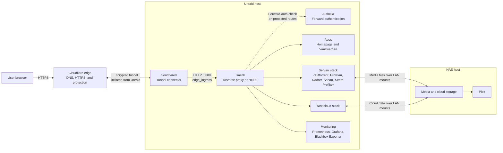

# Architecture overview

HavenStack is a collection of Docker Compose stacks split across an Unraid server and a NAS. Unraid runs the public ingress, authentication, applications, media automation, and monitoring services. The NAS provides media storage and runs Plex.

The central design rule is simple: Internet traffic enters through Cloudflare Tunnel, reaches one Traefik reverse proxy, and then crosses only the Docker network needed by the selected application.

Use [Networking](networking.md) for the complete network and port inventory, and [Storage](storage.md) for persistent paths, ownership, and backup boundaries.

## Request flow

There is no direct Internet connection to Traefik. The edge Compose stack publishes no host ports: `cloudflared` initiates the connection to Cloudflare, and it reaches Traefik by Docker DNS on `edge_ingress`.

## How an HTTPS request is handled

For a request to `https://radarr.example.com`:

1. Cloudflare DNS directs the hostname to the Cloudflare Tunnel.
2. Cloudflare accepts the visitor's HTTPS connection and terminates its TLS session at the Cloudflare edge.
3. Cloudflare carries the request over the encrypted tunnel that `cloudflared` initiated from Unraid.
4. `cloudflared` forwards the request over HTTP to `traefik:8080` on `edge_ingress`.
5. Traefik finds the router whose `Host(...)` rule matches `radarr.example.com`.
6. Traefik applies the configured rate limit, security headers, and Authelia forward-auth middleware.
7. After authorization, Traefik forwards the request to `radarr:7878` on `servarr_backend`.
8. The response returns through the same path.

The local HTTP hop does not mean that the Tunnel is unencrypted. The Cloudflare-to-`cloudflared` connection is encrypted; only communication inside the Docker network uses HTTP. This keeps certificate management out of Traefik while preserving HTTPS for visitors.

## Public hostnames

Cloudflare needs two published application routes:

| Hostname | Origin service | Purpose |
| --- | --- | --- |
| `example.com` | `http://traefik:8080` | Apex domain, used by Homepage |
| `*.example.com` | `http://traefik:8080` | First-level HavenStack application subdomains |

The wildcard route does not match `example.com`, which is why both routes are necessary. A final `http_status:404` catch-all rejects anything not handled by the two published routes.

Cloudflare handles only the public hostname-to-tunnel mapping. Traefik makes the second routing decision and selects the actual container. Adding a wildcard route does not automatically publish a container that has no matching Traefik router.

See [Configure the Cloudflare Tunnel](../getting-started/cloudflare-tunnel.md) for the complete setup.

## Main components

| Component | Location | Responsibility |
| --- | --- | --- |
| Cloudflare | Cloud | Public DNS, visitor HTTPS, and the external end of the Tunnel |
| `cloudflared` | Unraid edge stack | Maintains the outbound Tunnel and forwards requests to Traefik |
| Traefik | Unraid edge stack | Matches hostnames, applies middleware, and proxies to application containers |
| Authelia | Unraid edge stack | Authenticates requests for routes that use the forward-auth middleware |
| Homepage and Vaultwarden | Unraid apps stack | Landing page and password manager |
| Nextcloud | Unraid Nextcloud stack | File synchronization and collaboration services |
| Servarr applications | Unraid Servarr stack | Media requests, indexing, downloading, and library automation |
| Prometheus, Grafana, and Blackbox Exporter | Unraid monitoring stack | Metrics collection, dashboards, and endpoint probes |
| Plex | NAS | Serves the media library using host networking |

## Docker network layout

Traefik joins several narrowly scoped networks instead of placing every container on one large shared network.

| Network | Main members | Purpose |
| --- | --- | --- |
| `edge_ingress` | `cloudflared`, Traefik | The only hop from the Tunnel connector to the reverse proxy |
| `auth_backend` | Traefik, Authelia | Authentication checks; configured as an internal Docker network |
| `apps_backend` | Traefik, Vaultwarden, Nextcloud Apache, Blackbox Exporter | Application proxying and health probes |
| `servarr_backend` | Traefik, Servarr containers, Blackbox Exporter | Media automation proxying and health probes |
| `homepage_backend` | Traefik, Homepage, Blackbox Exporter | Homepage proxying; configured as an internal Docker network |
| `monitoring_backend` | Edge and monitoring services | Metrics and health checks; configured as an internal Docker network |
| `nextcloud_backend` | Nextcloud containers | Database, Redis, Apache, application, and notify-push communication |
| `nextcloud_egress` | Nextcloud application | Outbound access required by Nextcloud |

Docker provides name resolution only between containers that share a network. This is why:

- `cloudflared` can resolve `traefik` on `edge_ingress`;
- Traefik can resolve `authelia` on `auth_backend`;
- Traefik can resolve `radarr` on `servarr_backend`;
- a container on an unrelated network cannot reach those names automatically.

This segmentation limits unnecessary container-to-container access and makes network intent visible in the Compose files.

## Why the edge stack starts first

The edge stack creates the shared networks used by the other Unraid stacks. Those stacks declare networks such as `apps_backend`, `servarr_backend`, and `monitoring_backend` as external, so deployment fails if the networks do not exist yet.

Use this startup order:

1. `unraid/edge`;
2. `unraid/apps`;
3. `unraid/nextcloud`;
4. `unraid/servarr`;
5. `unraid/monitoring`.

The NAS stacks are deployed separately on the NAS because Docker networks do not span the two hosts. Communication between Unraid and the NAS uses LAN addresses and mounted storage rather than shared Docker networks.

## Authentication boundaries

Authelia is a Traefik middleware, not a global switch in front of every application. The current routes fall into two broad groups:

- administrative and media-management routes use Authelia forward authentication;
- applications such as Nextcloud and the main Vaultwarden interface use their own authentication flows.

Always check the matching file in `unraid/edge/config/traefik/dynamic/` before assuming that a hostname is protected by Authelia. A Cloudflare Tunnel route provides connectivity; it does not, by itself, require a user to sign in.

## Exposure boundaries

For the HavenStack web ingress path:

- the home router does not need inbound forwarding for ports `80` or `443`;
- Traefik port `8080` is not mapped to the Unraid host;
- the origin's public IP is not used by Tunnel DNS;
- the tunnel token is the credential that authorizes `cloudflared` to connect.

Plex uses host networking on the NAS. This LAN exposure is separate from the Cloudflare Tunnel. Keep its ports blocked from the public Internet unless a separate, intentional access design is added.

## Failure boundaries

The layer where an error appears usually identifies the problem:

| Symptom | Most likely layer |
| --- | --- |
| Tunnel shows `Down` or `Inactive` | `cloudflared` token, outbound firewall, or Cloudflare connectivity |
| Cloudflare returns `502` | `cloudflared` cannot resolve or connect to `traefik:8080` |
| Traefik returns `404` | No router matches the requested hostname or path |
| Authelia redirects or denies access | The route matched, but its authentication policy rejected the request |
| Traefik returns `502` for one application | The selected backend container is unhealthy or unreachable on its backend network |
| Application opens but data is missing | NAS mount, permissions, or application-level configuration |

This separation is useful during troubleshooting: verify Cloudflare, then `cloudflared`, then Traefik, then authentication, and finally the selected application and its storage.
