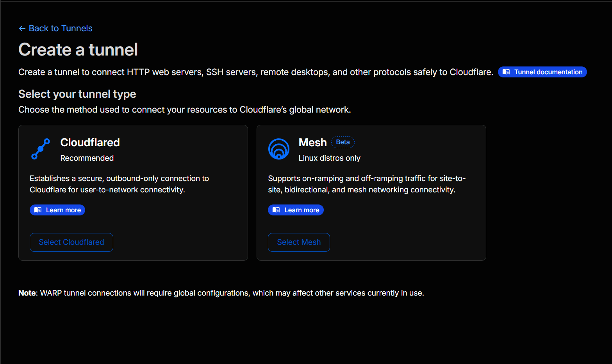
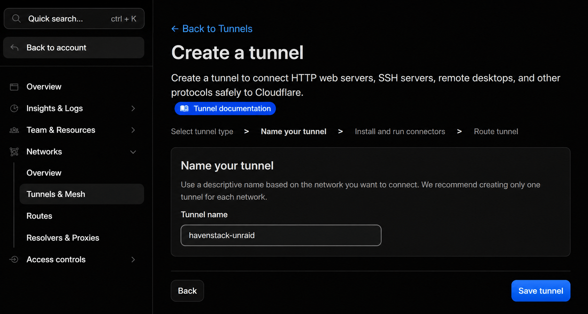
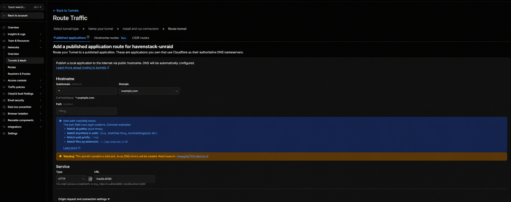
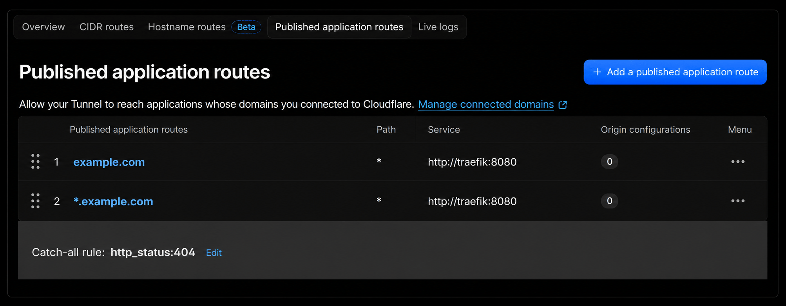
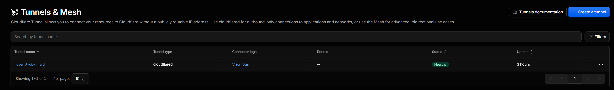

# Configure the Cloudflare Tunnel

HavenStack uses a remotely managed Cloudflare Tunnel as its public entry point. Visitors connect to Cloudflare over HTTPS, and the `cloudflared` container creates an outbound connection from Unraid to Cloudflare. You do not need to forward ports `80` or `443` on your router.

This guide uses `example.com` as a placeholder. Replace it with the value of `DOMAIN` in `unraid/.env`.

## What you will configure

The complete request path is:

```text
Browser
  -> HTTPS to Cloudflare
  -> encrypted Cloudflare Tunnel
  -> cloudflared container
  -> HTTP to traefik:8080 on edge_ingress
  -> the matching HavenStack service
```

TLS for the visitor connection terminates at Cloudflare. The tunnel between Cloudflare and `cloudflared` is encrypted, but the short origin hop from `cloudflared` to Traefik uses HTTP inside the Docker network. Traefik therefore does not need a public certificate for this design.

## Prerequisites

Before continuing, make sure that:

- you have a Cloudflare account;
- `example.com` has been added to Cloudflare and its nameservers are active;
- you can edit the domain's DNS records and tunnel configuration;
- you copied `unraid/.env.example` to `unraid/.env`;
- `DOMAIN=example.com` is set in `unraid/.env`.

Cloudflare occasionally changes dashboard labels. In the current dashboard, tunnels are available under **Networking > Tunnels**. In the Cloudflare One interface, the same area may appear under **Networks > Tunnels & Mesh** or **Connectors**.

## 1. Create a remotely managed tunnel

1. Sign in to the [Cloudflare dashboard](https://dash.cloudflare.com/).
2. Open **Networking > Tunnels**.
3. Select **Create a tunnel**.
4. Select **Cloudflared** as the tunnel type.

   

5. Give it a descriptive name, such as `havenstack-unraid`.
6. Select **Save tunnel** and complete the tunnel creation step.

   

Cloudflare will show installation commands for several platforms. Do not run the generated command: Docker Compose starts `cloudflared` for this project.

Instead, copy only the tunnel token. It is the long value that normally begins with `eyJ`.

## 2. Store the tunnel token

Open `unraid/.env` and replace the placeholder:

```dotenv
CLOUDFLARED_TUNNEL_TOKEN=eyJ...
```

The Compose file passes this value to the `cloudflared` container as `TUNNEL_TOKEN`.

Treat the token like a password. Anyone who has it can run a connector for this tunnel.

- Never commit `unraid/.env`.
- Never paste the token into an issue, pull request, screenshot, or log message.
- If it is exposed, rotate it in Cloudflare and update `unraid/.env` before restarting `cloudflared`.

## 3. Add the published application routes

Open the tunnel, find **Published application routes**, and add these rules in this order:

| Order | Public hostname | Path | Service |
| --- | --- | --- | --- |
| 1 | `example.com` | Leave blank | `http://traefik:8080` |
| 2 | `*.example.com` | Leave blank | `http://traefik:8080` |
| 3 | Catch-all | Not applicable | `http_status:404` |

Depending on the dashboard version, a blank path may be displayed as `*` after you save it.

For each of the first two routes:

1. Select **Add route** or **Add a published application route**.
2. Choose **Published application**.
3. Enter the hostname.
4. Select **HTTP** as the service type.
5. Enter `traefik:8080` as the service address.
6. Save the route.

For the wildcard route, the completed form should resemble this example:



Add the `http_status:404` catch-all last. It prevents requests that match no published route from reaching an unexpected origin.

The completed configuration looks like this in the dashboard:



Do not add unrelated hostnames. HavenStack requires only the apex and wildcard routes shown above.

### Create the wildcard DNS record

Adding an exact hostname route, such as `example.com`, makes Cloudflare create its DNS record automatically. **A wildcard route does not.** The route form displays the warning visible in the screenshot above: *This domain contains a wildcard, so no DNS record will be created.*

Without that record, the apex resolves but subdomains such as `auth.example.com` and `cloud.example.com` do not, and every subdomain request fails before reaching the Tunnel.

Copy the tunnel ID, the UUID shown on the tunnel's overview page. Then open **DNS > Records** for the zone and confirm that a wildcard record pointing to the tunnel exists. If it does not, create it:

| Field | Value |
| --- | --- |
| Type | `CNAME` |
| Name | `*` |
| Target | `TUNNEL_UUID.cfargotunnel.com` |
| Proxy status | Proxied |

Replace `TUNNEL_UUID` with the real tunnel ID. Keep the record **Proxied**: a DNS-only record pointing to `cfargotunnel.com` does not serve traffic. See the Cloudflare documentation on [routing DNS to a tunnel](https://developers.cloudflare.com/cloudflare-one/networks/connectors/cloudflare-tunnel/routing-to-tunnel/dns/) and [wildcard DNS records](https://developers.cloudflare.com/dns/manage-dns-records/reference/wildcard-dns-records/).

### Why both hostname routes are required

`*.example.com` matches first-level subdomains such as:

- `auth.example.com`;
- `cloud.example.com`;
- `radarr.example.com`;
- `vault.example.com`.

It does **not** match the apex domain `example.com`. HavenStack serves Homepage at the apex, so the explicit `example.com` route is required as well.

### Why the service name works

`traefik` is a Docker container name, not a public DNS name. Docker can resolve it because the `cloudflared` and `traefik` containers both join the `edge_ingress` network in `unraid/edge/compose.yml`.

Do not use `localhost:8080`. From inside the `cloudflared` container, `localhost` refers to `cloudflared` itself, not Traefik.

## 4. Validate and start the edge stack

First, validate the rendered Compose configuration:

```bash
docker compose --env-file unraid/.env \
  -f unraid/edge/compose.yml config --quiet
```

No output means that the Compose configuration is valid.

Start the complete edge stack:

```bash
docker compose --env-file unraid/.env \
  -f unraid/edge/compose.yml up -d
```

Check its state:

```bash
docker compose --env-file unraid/.env \
  -f unraid/edge/compose.yml ps
```

The `cloudflared`, `traefik`, and `authelia` containers should become `healthy`. A container can show `starting` during its health-check grace period; wait about one minute and check again.

## 5. Verify the tunnel

### In Cloudflare

Return to the tunnel page and confirm that:

- the tunnel status is **Healthy**;
- at least one connector is active;
- both `example.com` and `*.example.com` point to `http://traefik:8080`;
- the zone's DNS records include the proxied wildcard `CNAME` pointing to the tunnel;
- the final rule returns `http_status:404`.

A healthy tunnel looks like this in the tunnel list:



### From a client

Test the apex domain:

```bash
curl -I https://example.com
```

Then test a configured subdomain:

```bash
curl -I https://auth.example.com
```

A successful result may be `200`, a redirect, or an authentication response, depending on the Traefik router and Authelia policy. A Cloudflare `502` or `1033` error is not expected.

You can also confirm public DNS resolution:

```bash
nslookup example.com
nslookup auth.example.com
```

Do not expect DNS to reveal your home public IP. Requests are supposed to enter through Cloudflare Tunnel.

## Troubleshooting

### The tunnel is Inactive or Down

Check the connector logs:

```bash
docker logs --tail 100 cloudflared
```

Common causes are:

- an incomplete or incorrect `CLOUDFLARED_TUNNEL_TOKEN`;
- the token belongs to another tunnel;
- outbound traffic to Cloudflare is blocked;
- DNS resolution is unavailable to the container.

Cloudflare Tunnel uses outbound connections. On a restrictive firewall, allow `cloudflared` to reach Cloudflare on port `7844` over TCP and UDP. Do not solve this by forwarding inbound ports `80` or `443`.

### Cloudflare returns 502 Bad Gateway

This usually means Cloudflare reached `cloudflared`, but `cloudflared` could not reach Traefik.

Check both containers:

```bash
docker compose --env-file unraid/.env \
  -f unraid/edge/compose.yml ps cloudflared traefik

docker logs --tail 100 traefik
```

Then verify that both containers appear on `edge_ingress`:

```bash
docker network inspect edge_ingress
```

The published service must be exactly `http://traefik:8080`.

### Subdomains work, but the apex does not

Confirm that `example.com` has its own route. The `*.example.com` wildcard does not cover it.

### The apex works, but subdomains do not

Confirm that the `*.example.com` route exists and that the zone contains the proxied wildcard `CNAME` record pointing to `TUNNEL_UUID.cfargotunnel.com`. Cloudflare does not create that record automatically for wildcard routes; add it as described in [Create the wildcard DNS record](#create-the-wildcard-dns-record). Also make sure the requested hostname has a router in `unraid/edge/config/traefik/dynamic/`.

### A hostname returns 404

A `404` is correct for an unknown hostname. For an expected application, verify all three layers:

1. the apex or wildcard route matches in Cloudflare;
2. the request reaches `http://traefik:8080`;
3. a Traefik router contains the exact `Host(...)` rule.

## Security notes

- Keep inbound Internet port forwarding disabled for this ingress path.
- Keep Traefik's port `8080` unbound from the Unraid host; the Compose file intentionally exposes it only to Docker networks.
- A published Tunnel route makes a hostname reachable from the Internet. Traefik and each application still need the appropriate authentication policy.
- Rotate the tunnel token immediately if it may have been disclosed.
- Keep the catch-all rule last.

## Official Cloudflare references

- [Create a remotely managed tunnel](https://developers.cloudflare.com/cloudflare-one/networks/connectors/cloudflare-tunnel/get-started/create-remote-tunnel/)
- [Route published applications through a tunnel](https://developers.cloudflare.com/tunnel/routing/)
- [Manage and rotate tunnel tokens](https://developers.cloudflare.com/tunnel/advanced/tunnel-tokens/)
- [How outbound-only Cloudflare Tunnel connections work](https://developers.cloudflare.com/cloudflare-one/networks/connectors/cloudflare-tunnel/)
